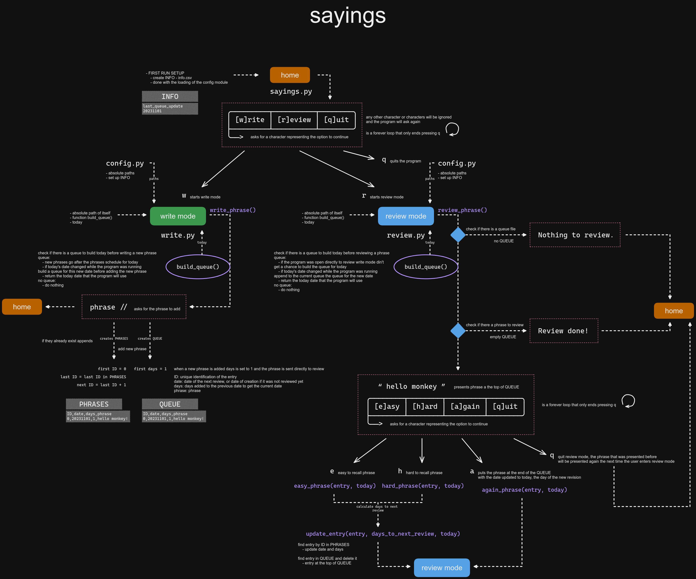

# Sayings

Learn popular sayings, phrases your friends say, or anything that can be put in a sentence.

A simple Python command line application.


## Use

Run sayings.py, you are welcomed with "home" of the program.

```
╭─────────┬──────────┬────────╮
│ [w]rite │ [r]eview │ [q]uit │
├─────────┴──────────┴────────╯
╰──>
```

Press option and then enter to continue.

**w** prompts you to write a new phrase to add to your collection of phrases.

```
phrase //
```
**r** sends you into "review mode", presenting a phrase to review, if there is one, and asking you to rate the difficulty of the phrase.

```
  “ phrase ”

╭────────┬────────┬─────────┬────────╮
│ [e]asy │ [h]ard │ [a]gain │ [q]uit │
├────────┴────────┴─────────┴────────╯
╰──>
```

"difficulty of the phrase" means how difficult is to remember the phrase you are learning.

An _easy_ to remember phrase, **e**, will be presented to you again for review after a relatively long period of time, in comparison to the other options.

A _hard_ to remember phrase, **h**, will be presented to you for review in half the time of the easy option.

_Again_, **a**, means the phrase is even harder to remember so it will be put at the end of the list of phrases to review that the program has prepared for you.

**q** _quit_ sends you back to home. The last phrase shown will be presented again the next time you enter "review mode".


## Structure of the Program

```
├─ sayings.py         runs the program
├─ write.py           writing module
├─ review.py          reviewing module
├─ build_queue.py     queue building module
├─ config.py          set up and program data
└─ data/              user data
   ├─ info.csv
   ├─ phrases.csv
   ├─ phrases_temp
   ├─ queue.csv
   └─ queue_temp
```

-   [sayings.py](#sayingspy)
-   [write.py](#writepy)
-   [review.py](#reviewpy)
-   [build_queue.py](#build_queuepy)
-   [config.py](#configpy)
-   [info.csv](#infocsv)
-   [phrases.csv](#phrasescsv)
-   [queue.cs](#queuecsv)


### Map of the Program




### sayings.py

`sayings.py` is the entry point to the program. Running it in the terminal with Python 3 brings you to a simple CLI interface.

This interface is called "home". It is an infinite loop that ask the user for one of three options.

-   _write_ runs the write_phrase() function imported from the write module.

    The function starts "write mode", asks for a new phrase to add. After the phrase is added the function brings you back home.

-   _review_ runs the review_phrase() function imported from the review module.

    The function starts "review mode", presents a phrase to review and rate. After the phrase is rated, another phrase will be presented, if there is another phrase to review, this is another infinite loop. The loop ends if there is no more phrases to review or if the user presses "q" to quit. In both cases the program comes back to home.

-   _quit_ breaks out of the loop and the program ends.


### write.py

Is the writing module. Contains a function called write_phrase().

write_phrase()
-   input:
    -   csv module
    -   build_queue()
        -   today's date used by the program
    -   config module
        -   absolute paths to user data files
    -   fieldnames
-   output:
    -   creation of or appending to phrases.csv of the new phrase added
    -   creation of or appending to queue.csv of the new phrase added


### review.py

Is the reviewing module. Contains a function called review_phrase() that sets the "review mode". It also contains other four supporting functions, easy_phrase(), hard_phrase(), again_phrase(), and update_phrase().

review_phrase()
-   input:
    -   csv module
    -   build_queue()
        -   today's date used by the program
    -   config module
        -   absolute paths to user data files
    -   easy_phrase()
    -   hard_phrase()
    -   again_phrase()
-   output:
    -   updated phrases.csv and queue.csv based on user input

easy_phrase()
-   input:
    -   days, days added last time to the entry to calculate the new review date
-   output:
    -   days to next review
    -   passes those days to update_entry().

hard_phrase()
-   input:
    -   days, days added last time to the entry to calculate the new review date
-   output:
    -   days to next review
    -   passes those days to update_entry().

update_entry()
-   input:
    -   csv module
    -   datetime and timedelta from datetime module
    -   copy from shutil module
    -   config module
        -   absolute paths to user data files
    -   fieldnames
-   output:
    -   updated phrases.csv entry with the new date to review
    -   updated queue.csv removing the reviewed entry

again_phrase()
-   input:
    -   csv module
    -   copy from shutil module
    -   config module
        -   absolute paths to user data files
    -   fieldnames
-   output:
    -   updated queue.csv with the entry reviewed moved from the top of the queue to the end


### build_queue.py

Is the queue building module. Contains a function called build_queue().

build_queue()
-   input:
    -   csv module
    -   date from datetime module
    -   config module
        -   absolute paths to user data files
    -   fieldnames
-   output:
    -   today's date used by the program
    -   updated QUEUE
    -   updated INFO with the new last date of queue update


### config.py

Sets up the program in the first run with a INFO file with "today's date".

Sets all the absolute paths that the program will use later, and creates a directory for the user data files.


### info.csv

To build a new queue is necessary to know the last time that the queue was updated. This is achieved with the date saved in this file.

As long as there is a queue to review the date of the last entry in the queue is the last time the queue was updated. But this method cannot be used when the queue is empty.

Another method to get this date is by finding the smallest date in the PHRASES file. This date may or may not coincide with the actual last update by is in functionally correct. The problem is that the PHRASES file is the biggest file and getting the date from there could be more processing expensive that the method I use, just creating a new file to hold the date.

Info in the future could also hold other information useful for extra functionality.


### phrases.csv

User data file in comma separated values format. Also called PHRASES.

    ID,date,days,phrase

- ID: unique identification for the entry.
- date: date of the next review, or date of creation if it was not reviewed yet.
- days: days added to the previous date to get the current date.
- phrase: phrase.

All data is save in the file as strings but in the program are treated as follows

- ID: positive integer
- date: positive integer representing a date in the format year month days "YYYYMMDD".
- days: positive integer
- phrase: string


#### phrases_temp

Just a temporary file used to update phrases.csv. Could have used the tempfile module but I chose this approach for clarity.


### queue.csv

User data file in comma separated values format. Also called QUEUE. The same format as phrases.csv.


#### queue_temp

Just a temporary file used to update queue.csv. Could have used the tempfile module but I chose this approach for clarity.


## Install


### Linux Install

1.  Install Python.
1.  Clone the repository.

    Clone the repository in a folder of your choice. This folder is the one you are going to use in the `sayings` executable below. In this example the folder will be `~/apps/`.

    ```sh
    ~ $ cd apps
    ~/apps $ git clone https://github.com/pullant/sayings.git
    ```

1.  Make the program available to the system.

    -   Create the `sayings` executable.
        -   Create a new file anywhere, we will move it later.

            ```sh
            $ touch sayings
            ```

        -   Open `sayings` in a editor and add the following. This is the command to execute the program. The path will depend on where you cloned the repository previously. It should look like `python3 <your path>/sayings/sayings.py`.

            ```sh
            #!/bin/sh
            python3 ~/apps/sayings/sayings.py
            ```

            Save it and close the editor.

        -   Make `sayings` executable.

            ```sh
            $ chmod +x sayings
            ```

    -   Move the `sayings` executable to a location in your PATH.

        These commands will print all the locations in your PATH, one per line.

        ```sh
        $ echo $PATH | tr ':' '\n'

        or

        $ echo $PATH | sed 's/:/\n/g'
        ```

        One common location to use is `/home/name/.local/bin/`.

        Move sayings to the folder of your choice in PATH.

Now the program is available everywhere in your system. To run it just type `sayings` and press enter.

```sh
$ sayings
```


## TODO

- add command line argument --reset to reset the app data to zero.
- add delete option in review mode to delete the phrase reviewing a that moment.
- add edit option in review mode, maybe.

